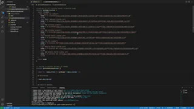

#  good-readme-generator  [](https://opensource.org/licenses/MIT)

  ## Description
  
  The aim of this project is to create a command line interface which will generate a README file based off of user inputs. 
  
  While working on this project I have increased my knowledge of node.js and the use of npm applications; fs, inquirer and util. I also implemented JS modularization which helps by separating code into more manageable and secure sections.

  A future update would aim to improve the usability of the application by adding a checkbox selection of contents which the user can toggle to decide which subheadings to include in the README.
  

  ## Table of Contents
  
  * [Installation](#installation)
  * [Usage](#usage)
  * [License](#license)
  * [Tests](#tests)
  * [Questions](#questions)

  ## Installation
  
  To use this application, please clone the repo, linked [here](https://github.com/stuart540/good-readme-generator), then type `npm install` in command line to download the node-modules.
  ```md
  npm install
  ```
 

  ## Usage 

  This application runs using node.js. Once the node-modules are installed, just navigate to the root file and run using the command line:
  ```md
  node index.js
  ```
  
  Please check out the short video sample showing the application running in node.js.

  [](https://youtu.be/pYuz1h_vwos)
  

  ## License
  
  This project is licensed under the The MIT License.
  

  ## Questions

  Please check out my [GitHub Profile](https://github.com/stuart540/).

  If you have any questions please feel free to drop me an e-mail <stuart54l@gmail.com>.


  ---